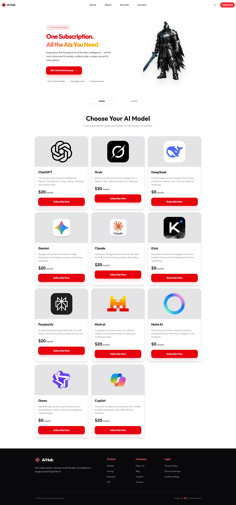

# AI Model Hub

A simple React project that I built to practice component-based development, state management, data fetching, and cart functionality.

The application displays different AI models and lets users add models to a cart and manage their selections.

## Features

* Browse available AI models
* Add models to the cart
* View selected models in the cart
* Switch between Models and Cart sections
* Dynamic cart item count
* Toast notifications
* Reusable React components

## Technologies Used

* React
* JavaScript (ES6+)
* Vite
* Tailwind CSS
* DaisyUI
* React Icons
* React Toastify

## What I Practiced

* React components and props
* `useState()` for state management
* Fetching local JSON data
* Conditional rendering
* Passing state and functions between components
* Rendering dynamic lists
* Cart functionality
* Toast notifications

## Data Source

AI model data is loaded from a local `models.json` file using `fetch()`.

## Live Website

[View Live Website](https://ai-model-hub-page.netlify.app/)

## Screenshot

### GitHub: [FahmidaAkterShimu](https://github.com/FahmidaAkterShimu)
